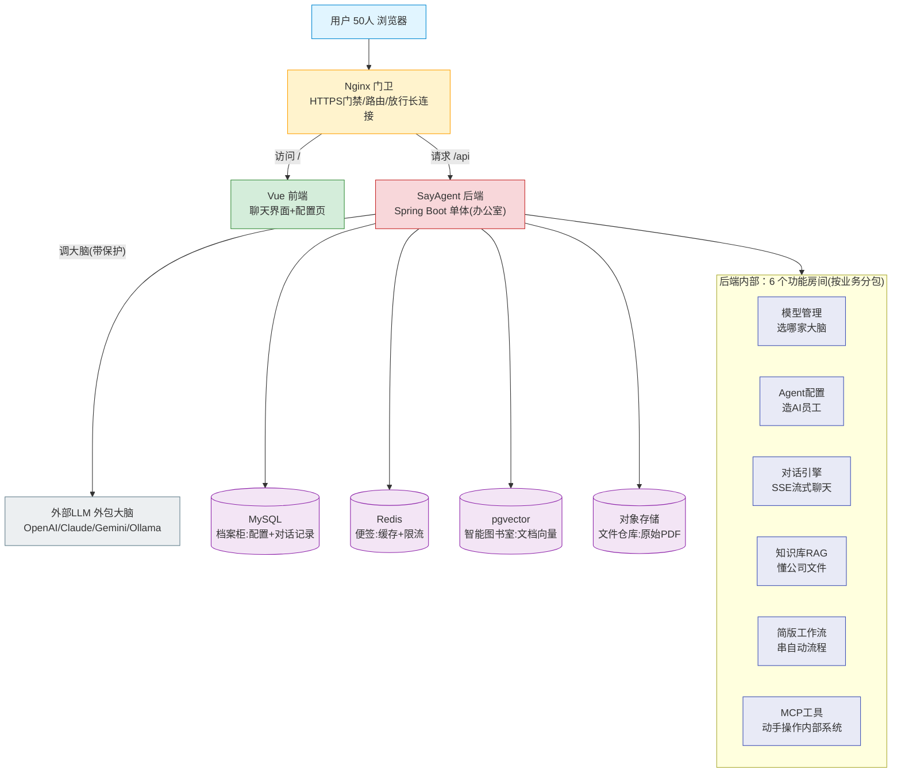

# 08_架构图与讲解

> 一句话结论：SayAgent 就像一栋「AI 服务小楼」——用户从大门（Nginx）进来，在接待大屏（Vue）操作；真正干活的是后办公室（Spring Boot），它请外包大脑（LLM）思考，并从三个仓库（MySQL / Redis / pgvector）取资料。
> 本文档给一张直观架构图 + 每部分「干嘛/怎么实现」+ **Java 术语人话词典**，专为不熟悉 Java 的读者准备。

---

## 1. 架构总图

> 若上方未渲染成图，看第 2 节文字版，内容一致。

---

## 2. 每部分「干嘛 + 怎么实现」

**① 用户（50 人浏览器）**
- 干嘛：团队同事打开网址来用。
- 实现：普通电脑/手机浏览器，无需装软件。

**② Nginx（门卫）**
- 干嘛：所有访问先过它；管 HTTPS 门锁；把「看页面」和「调接口」分到不同房间；放行聊天长连接。
- 实现：Docker 里跑 Nginx，配好路由和超时（SSE 要放宽）。

**③ Vue 前端（接待大屏）**
- 干嘛：你看到的按钮、聊天框、配置表单都在这；它自己不思考，只负责把你的操作转告后端。
- 实现：Vue 3（一种做网页界面的框架）写，打包成静态网页，交给 Nginx 托管。

**④ SayAgent 后端（办公室，Spring Boot 单体）**
- 干嘛：所有大脑逻辑都在这一套 Java 程序里。
- 实现：一个 Spring Boot 程序，内部按业务切成 6 个「房间」，部署时跑 2 个副本防宕机。

**⑤ 后端内部 6 个房间**

| 房间 | 干嘛 | 怎么实现 |
|---|---|---|
| 模型管理 | 选用哪家大脑 | 管理员填 LLM 密钥，存 MySQL，全公司共用 |
| Agent 配置 | 造一个 AI 员工 | 表单：写人设提示词 + 选模型 + 挂知识/工具 |
| 对话引擎 | 真聊天 | `SseEmitter`（Spring 的流式工具）逐字返回 |
| 知识库 RAG | 让 AI 懂公司文件 | 文档切分→转向量→存 pgvector→提问时检索 |
| 简版工作流 | 把几步串成自动流程 | 顺序节点编排，逐个执行 |
| MCP 工具 | 让 AI 动手操作内部系统 | 连内部 Server，自动发现并调用工具 |

**⑥ 外部 LLM（外包大脑）**
- 干嘛：真正生成回答的「脑子」，SayAgent 自己不会思考，请它代劳。
- 实现：用 Resilience4j 包一层保护（超时/重试/熔断/备用），不稳也不会拖垮本楼。

**⑦ 四个仓库**

| 仓库 | 比喻 | 干嘛 | 怎么实现 |
|---|---|---|---|
| MySQL | 档案柜 | 存配置、对话记录（要准确长期） | JPA + Flyway 自动建表 |
| Redis | 便签本 | 缓存热门配置、限流计数（要快） | 单实例 + 持久化 |
| pgvector | 智能图书室 | 存文档向量，按意思找相关内容 | PostgreSQL 开 pgvector 扩展 |
| 对象存储 | 文件仓库 | 存你上传的 PDF/Word 原件 | 服务器硬盘或 S3 |

**⑧ 部署（这楼怎么立起来）**
- 干嘛：把上面所有零件装好、能对外服务。
- 实现：每个零件打进 Docker 集装箱 → 用 K8s 调度（后端 2 副本、数据库各 1 套、配置/密码单独锁好）。

---

## 3. Java 术语人话词典（重点：看不懂 Java 词来这查）

> 前提：你只会 Python。下面把架构里出现的 Java 词，全部翻译成「你已有的认知」或生活比喻。

| Java 术语 | 人话解释 | 对应你熟悉的 Python 概念 |
|---|---|---|
| **Java** | 一门编程语言，和 Python 一样能写程序，但语法更啰嗦、要编译。 | Python 本身 |
| **JVM** | Java 的「运行虚拟机」，Java 代码编译后跑在它上面。 | 类似 Python 解释器，但更重 |
| **Spring Boot** | Java 造网站/后台的「快速脚手架框架」。它帮你把很多重复活（路由、配置、安全）预先做好，你只填业务。 | 类似 FastAPI / Django 的角色（只是 Java 版） |
| **单体（Monolith）** | 所有功能塞进「一个程序」里，一起启动、一起部署。 | 一个 Python 大项目跑一个进程 |
| **微服务** | 把功能拆成「多个小独立程序」，各自跑各自。SayAgent 现在不用。 | 多个 Python 服务分别部署 |
| **包（package）** | Java 里把代码按文件夹分类的方式（如 `agent/`、`knowledge/`）。 | Python 的包/目录 |
| **依赖注入（DI）** | Spring 自动把「你需要的零件」塞给你，你不用自己 `new`。 | 类似全局单例/容器自动装配 |
| **@Controller / @Service / @Repository** | Spring 的「角色标签」：分别标「接待请求」「干业务」「存数据」的类。 | 路由函数 / 业务逻辑 / 数据访问层 |
| **SseEmitter** | Spring 自带的「直播工具」：让后端能把回答一个字一个字推到前端，而不是等全部生成完才发。 | 类似 Python 的 `yield` 流式返回 / `StreamingResponse` |
| **Resilience4j** | 一个「保护套」库，专门管：超时、重试、熔断（坏了对它拉闸）、限流。 | 自己写的 try/except + 重试逻辑，但它更全 |
| **JPA / Hibernate** | Java 操作数据库的「自动挡工具」：用类映射表，少写 SQL。 | SQLAlchemy（Python 的 ORM） |
| **Flyway** | 数据库的「版本管理」：你写脚本说「要建哪些表」，它自动按顺序执行、且只执行一次。 | 类似 Alembic 迁移（你前面 FastAPI 方案里的） |
| **Maven / Gradle** | Java 的「装依赖 + 打包」工具（从网上下库、打成可运行包）。 | 对应 `pip` / `uv` / `requirements.txt` |
| **Lombok** | 一个小插件：自动帮你生成 `getter/setter` 等样板代码，少写重复字。 | 无直接对应，算语法糖 |
| **副本（replicas）** | 同一个程序「多跑几份」，一个挂了还有备胎顶上。 | 多开几个 Python 进程做负载均衡 |
| **Actuator** | Spring 自带的「健康检查页」，告诉 K8s 它还活着没。 | `/health` 接口 |
| **yml / properties** | Spring 的配置文件格式，写数据库连接、超时等。 | `.env` / `config.yaml` |

---

## 4. 非 Java 但易混的术语（简表）

| 术语 | 人话 |
|---|---|
| **Vue** | 做网页前端的框架（和 React 同类），负责你看到的界面 |
| **Nginx** | 反向代理/门卫（非 Java 专有，很多语言都用） |
| **Docker** | 把程序和运行环境打包成「集装箱」，到哪都能跑 |
| **K8s（Kubernetes）** | 管这些集装箱的「调度员」：自动重启、扩容、安排位置 |
| **pgvector** | PostgreSQL 数据库的一个扩展，能存「向量」并做相似度搜索 |
| **RAG** | 让 AI 先去资料库找相关内容，再回答（防胡说） |
| **MCP** | 一种标准协议，让 AI 能连上公司内部工具/系统去「动手」 |
| **LLM** | 大语言模型，就是「外包大脑」（ChatGPT 那类） |
| **SSE** | 服务器推送事件，一种让回答「逐字直播」给浏览器的技术 |

---

*本文档配合 01~07 使用：01 定功能、02 定技术、03 通俗场景、04 LLM 调用、05 部署、06 目录、07 性能。本篇是「一眼看懂整体 + Java 词翻译」。*
